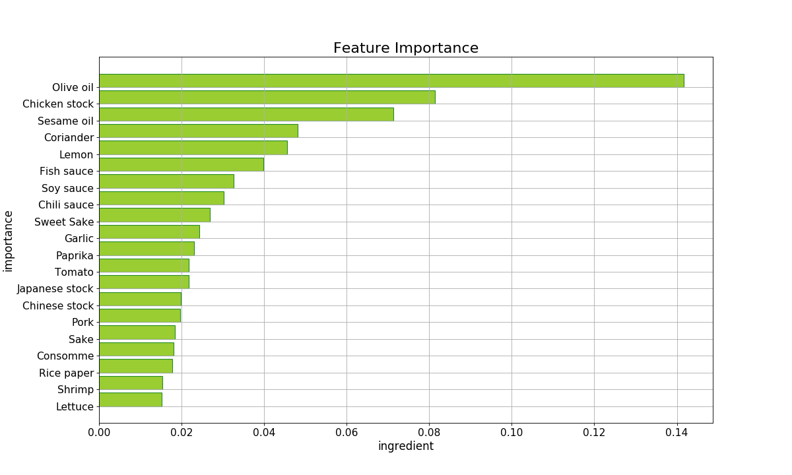

# Step4: Training
## toi_tra.py
"toi_tra.py" is a program for training.

```sh
~/work $ ll
...
-rw-r--r--   1 takashi  staff   936  3  1 21:48 toi_tra.py
...
~/work $
```

## Runnning
Run as follows.

```sh
~/work $ python3 toi_tra.py train_feature_dense.pkl train_target_vec.pkl
[2019/04/07 21:10:40] ========== toi_tra.py start ==========
[2019/04/07 21:10:40] --model--
[2019/04/07 21:10:40] RandomForestClassifier(bootstrap=True, class_weight=None, criterion='gini',
            max_depth=None, max_features='auto', max_leaf_nodes=None,
            min_impurity_split=1e-07, min_samples_leaf=1,
            min_samples_split=2, min_weight_fraction_leaf=0.0,
            n_estimators=10, n_jobs=1, oob_score=False, random_state=0,
            verbose=0, warm_start=False)
[2019/04/07 21:10:40] --importances (top 20)--
[2019/04/07 21:10:40] 001: Olive oil (id=78, frq=35, imp=0.14162)
[2019/04/07 21:10:40] 002: Chicken stock (id=46, frq=29, imp=0.08143)
[2019/04/07 21:10:40] 003: Sesame oil (id=7, frq=34, imp=0.07129)
[2019/04/07 21:10:40] 004: Coriander (id=98, frq=25, imp=0.04817)
[2019/04/07 21:10:40] 005: Lemon (id=31, frq=25, imp=0.04559)
[2019/04/07 21:10:40] 006: Fish sauce (id=47, frq=33, imp=0.03985)
[2019/04/07 21:10:40] 007: Soy sauce (id=8, frq=53, imp=0.03268)
[2019/04/07 21:10:40] 008: Chili sauce (id=99, frq=11, imp=0.03023)
[2019/04/07 21:10:40] 009: Sweet Sake (id=9, frq=19, imp=0.02682)
[2019/04/07 21:10:40] 010: Garlic (id=17, frq=66, imp=0.02424)
[2019/04/07 21:10:40] 011: Paprika (id=72, frq=24, imp=0.02309)
[2019/04/07 21:10:40] 012: Tomato (id=82, frq=14, imp=0.02170)
[2019/04/07 21:10:40] 013: Japanese stock (id=14, frq=21, imp=0.02168)
[2019/04/07 21:10:40] 014: Chinese stock (id=44, frq=7, imp=0.01979)
[2019/04/07 21:10:40] 015: Pork (id=18, frq=34, imp=0.01968)
[2019/04/07 21:10:40] 016: Sake (id=6, frq=26, imp=0.01841)
[2019/04/07 21:10:40] 017: Consomme (id=84, frq=11, imp=0.01808)
[2019/04/07 21:10:40] 018: Rice paper (id=97, frq=11, imp=0.01773)
[2019/04/07 21:10:40] 019: Shrimp (id=63, frq=19, imp=0.01542)
[2019/04/07 21:10:40] 020: Lettuce (id=105, frq=10, imp=0.01524)
(view graph)
...
~/work $
```

### Feature importance bar graph
This graph image is saved in the 'data' directory.


## Check
After running this program, check the following files.

- toi_model_0.10.3.pkl : saved classifier with scikit_ver
- train_feature_dence.png : feature importances graph

```sh
~/work/data $ ll
total 320
...
-rw-r--r--   1 takashi  staff   45158  4  7 21:10 toi_model_0.10.3.pkl
-rw-r--r--@  1 takashi  staff   51040  4  7 21:10 train_feature_dense.png
...
~/work/data $
```
